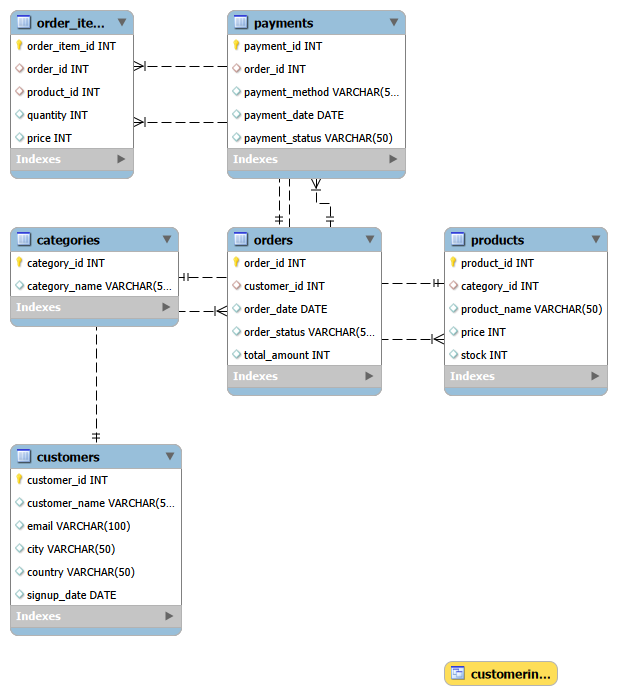
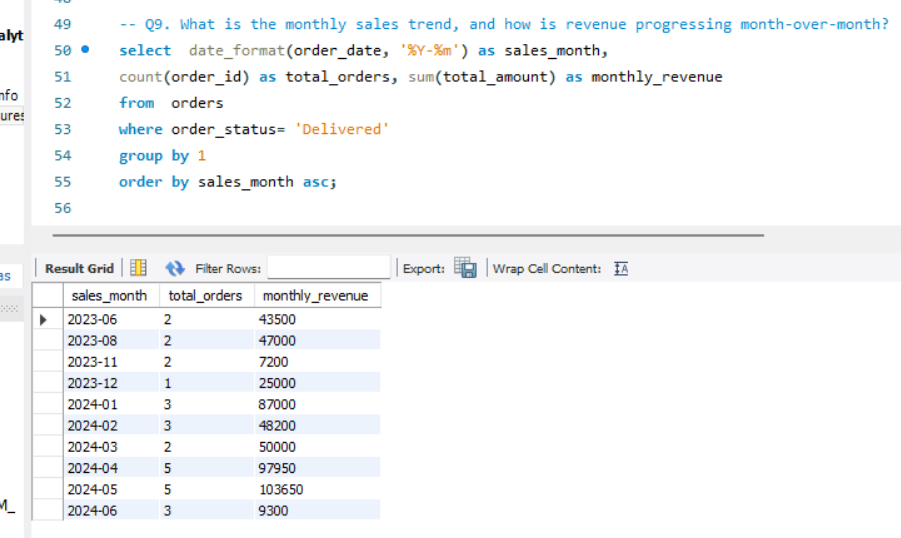
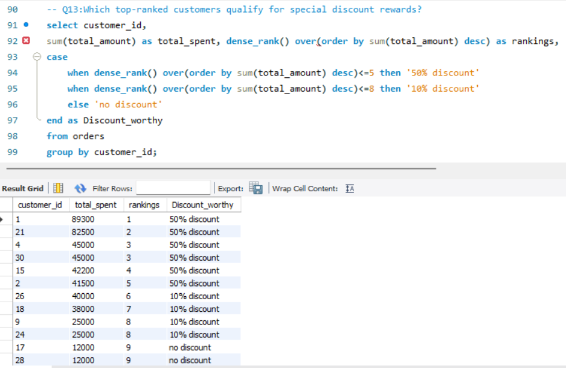
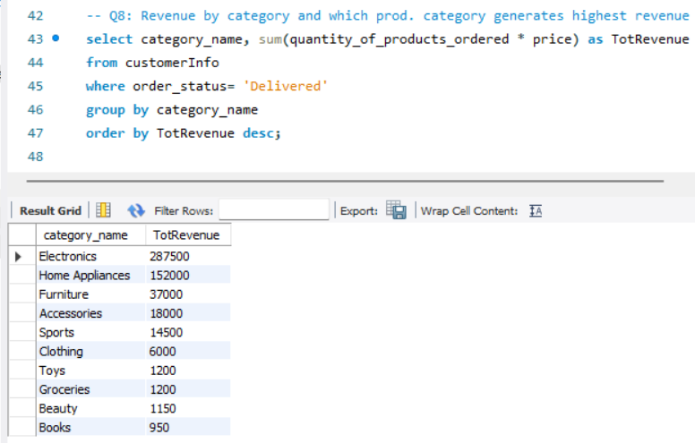
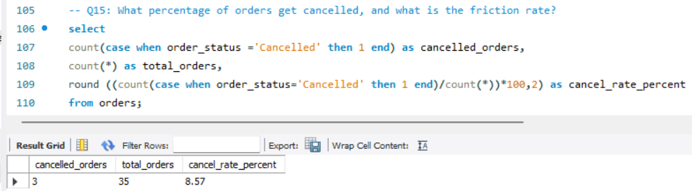

# E-Commerce Data Analytics and Customer Insights

## Entity Relationship Diagram (ERD)

---

## Project Overview
This project presents an end-to-end SQL analytics solution for an e-commerce platform. Using MySQL, I built a (sample) relational database schema from scratch and wrote a comprehensive set of analytical queries to extract actionable business intelligence from transactional data. 

The analysis focuses on key operational metrics, including gross revenue performance, category sales distribution, month-over-month trends, customer purchasing behavior, and order cancellation rates.

---

## Project Structure

* `01_schema_and_data.sql`: Database definition (DDL) and initial data population (DML).
* `02_analytics_queries.sql`: SQL queries addressing core business questions, views, and analytical models.
* `assets/`: Image assets containing the ERD diagram and query result screenshots.
* `README.md`: Documentation detailing the project scope, schema, and analytical findings.

---

## Database Architecture

The dataset is structured across 6 relational tables within the `Ecommerce_Analytics` database:

1. `customers`: Stores customer details, registration dates, and geographic locations.
2. `categories`: Defines broad product category classifications.
3. `products`: Contains product catalog details and individual item pricing.
4. `orders`: Tracks transaction headers, order dates, total amounts, and delivery statuses.
5. `order_items`: Stores line-item breakdowns connecting products to specific orders, including quantities and prices.
6. `payments`: Maps payment methods used for completed orders.

---

## Technical Approach & SQL Techniques

* **Master Reporting View:** Created a reusable view (`CustomerInfo`) joining customer, order, product, and payment details to simplify downstream reporting.
* **Revenue & Trend Analysis:** Applied aggregate functions (`SUM`, `AVG`, `COUNT`) and date formatting (`DATE_FORMAT`) to evaluate sales velocity and track month-over-month revenue trends.
* **Customer Segmentation:** Utilized window functions (`DENSE_RANK`) to rank top spenders and applied conditional logic (`CASE WHEN`) to segment customers into spending tiers and determine discount eligibility.
* **Operational Insights:** Evaluated top-performing products by volume and order frequency, and calculated overall order cancellation percentages to identify fulfillment bottlenecks.

---

## Key Insights & Sample Outputs

### 1. Monthly Revenue Trends
Analyzing sales across months shows clear revenue momentum and order volume growth over time.

### 2. Customer Discount Allocation
Using window functions, top-spending customers were ranked and assigned targeted loyalty rewards based on their contribution to gross revenue.

### 3. Category Revenue Breakdown
Querying the master reporting view highlights top-performing categories driving overall platform sales.

### 4. Order Cancellation Rate
Evaluating delivery statuses with conditional aggregation provides a clear operational baseline for measuring order friction.

---

## How to Run the Scripts

1. Open MySQL Workbench and connect to your local MySQL server.
2. Execute `01_schema_and_data.sql` to construct the tables and insert sample records.
3. Execute `02_analytics_queries.sql` to run the analytical queries, build the reporting view, and inspect results.

---

## Tools Used

* **Database Engine:** MySQL Server
* **Interface:** MySQL Workbench
* **Concepts Applied:** Joins, Aggregation, Window Functions, Case Statements, Subqueries, Views, Date & String Functions
